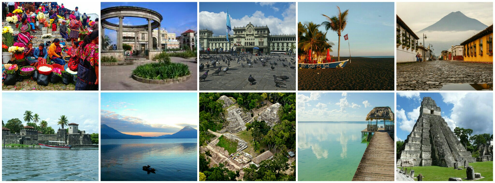

```{r setup, include=FALSE}
knitr::opts_chunk$set(echo = TRUE)
options(repos='http://cran.rstudio.com/')
packages<-c("leaflet")
if (length(setdiff(packages, rownames(installed.packages()))) > 0) {
  install.packages(setdiff(packages, rownames(installed.packages())))  
}
library(leaflet)
```

## <span style="color:#FC345C"> Instructions </span> 

Create a web page using R Markdown that features a map created with Leaflet.
Host your webpage on either GitHub Pages, RPubs, or NeoCities.
Your webpage must contain the date that you created the document, and it must contain a map created with Leaflet. We would love to see you show off your creativity!

## <span style="color:#FC345C"> Review Criteria </span> 

The rubric contains the following two questions:

1. Does the web page feature a date and is this date less than two months before the date that you're grading this assignment?
2. Does the web page feature an interactive map that appears to have been created with Leaflet?

## <span style="color:#FC345C"> Guatemala </span> 

Guatemala, land of diversity, multiculturalism, where the amount of colors and smiles leaves a mark on anyone who knows. Mountains that impose themselves, leaving you with the sensation of smallness, where the jaguar and the quetzal strut among green and greenery. Simple people, friendly, respectful and proud of their roots, where it is possible to travel in time with only a couple of hours of crossing.If you want to travel to this beautiful country i just leave you a "do not miss" places list and the map could lead you. 




* Tikal
* Peten Itza Lake
* Semuc Champey
* Atitlan Lake
* Rio Dulce
* Antigua Guatemala
* Yaxha (Lake and National Park)
* Monterrico
* Central Park
* Quetzaltenango
* Chichicastenango


```{r gt_map}
gtmap<-leaflet() %>% addTiles() %>%
       addMarkers(lat=17.1992345,lng=-89.6196319,popup="Tikal, Guatemala") %>%
       addMarkers(lat=16.9644256,lng=-89.9098679,popup="Peten Itza Lake") %>%
       addMarkers(lat=15.5330099,lng=-89.9590383,popup="Semuc Champey") %>%
       addMarkers(lat=14.6789708,lng=-91.2714047,popup="Atlitan Lake") %>%
       addMarkers(lat=15.6513961,lng=-89.0056313,popup="Rio Dulce") %>%
       addMarkers(lat=14.5533248,lng=-90.7375397,popup="Antigua Guatemala") %>%
       addMarkers(lat=17.0734446,lng=-89.4046684,popup="Yaxha (Lake and National Park)") %>%
       addMarkers(lat=13.8925497,lng=-90.4852414,popup="Monterrico") %>%
       addMarkers(lat=14.6418289,lng=-90.5152717,popup="Central Park") %>%
       addMarkers(lat=14.8375639,lng=-91.5584714,popup="Quetzaltenango") %>%
       addMarkers(lat=14.9390952,lng=-91.114986,popup="Chichicastenango") 
gtmap
```


For more information you can consult this links:

* http://www.visitguatemala.com/
* http://www.inguat.gob.gt/inicio.php


